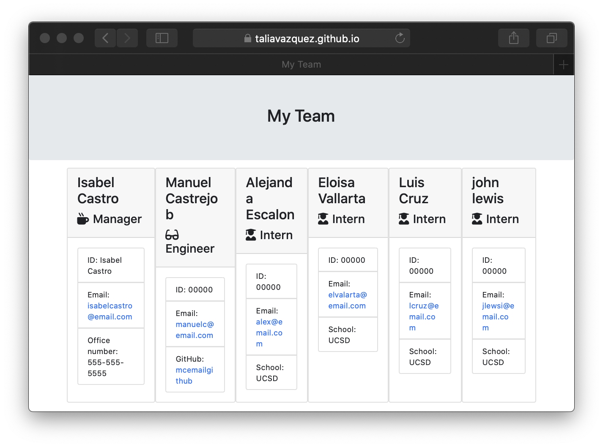

# Engineering Team Generator

## Description:
    This site will help you generate a small Engineering Team, the team will include ata minimum a Manager, an Engineer, and an Intern.## Installation:
    In order to be able to use this Team Generator, you will need to clone this Repo. Once you have cloned it, you will need to download node_modules.
## Usage:
    This will be useful for generating quick teams
## Test
    nmp run test
## Credits:
    Aldo Carrillo and Ana Luna
## License:

- [License](https://opensource.org/licenses/MIT)
## Questions:
Feel free to reach out to me with any questions, contact me via email. vazqueztalia@outlook.com
- [GitHub Profile](https://github.com/taliavazquez)
## Project Links:
- [Repo](https://github.com/taliavazquez/engineering-team-generator)
- [Deployed Site](https://taliavazquez.github.io/engineering-team-generator/output/team.html)

